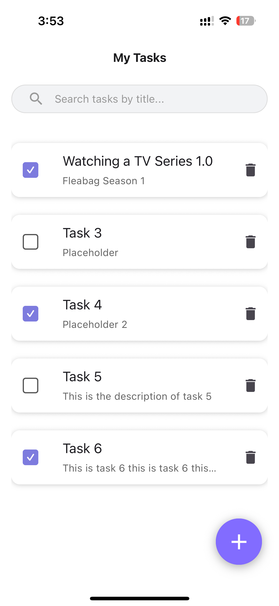
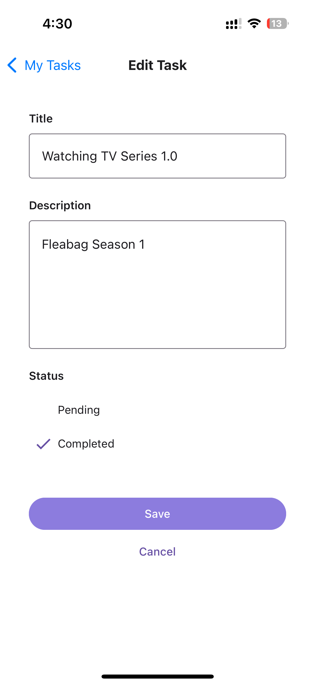
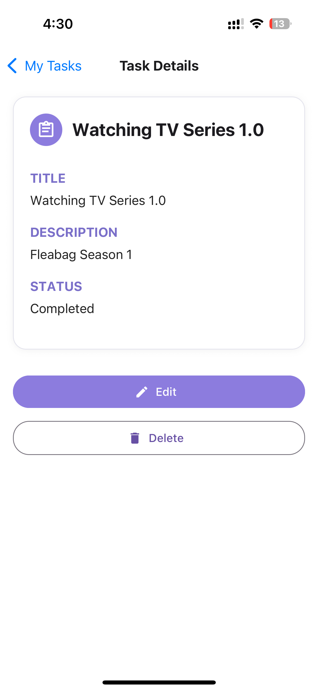
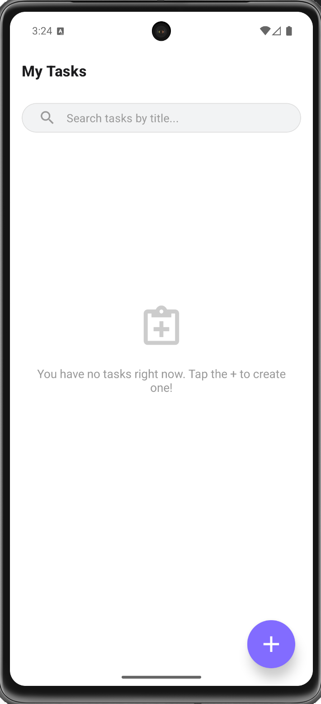
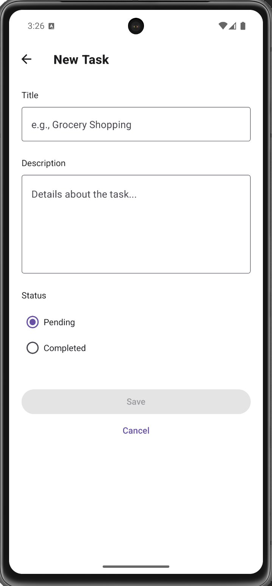
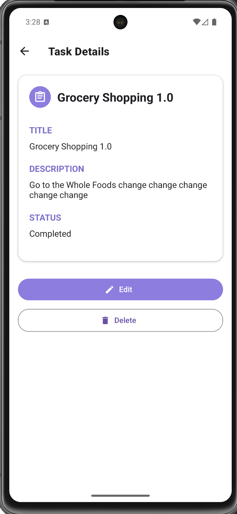

# task-manager-app

A simple task management mobile app built with **React Native**, **Expo**, and **TypeScript**.  
It allows users to add, edit, delete, and toggle task status. Users can also search tasks by title.

## Getting Started

After cloning this repository:

```bash
cd task-manager-app
cd task-manager
npm install
npx expo start
```

## Test Screenshots on iOS and Android devices

### iOS





### Android Simulator



